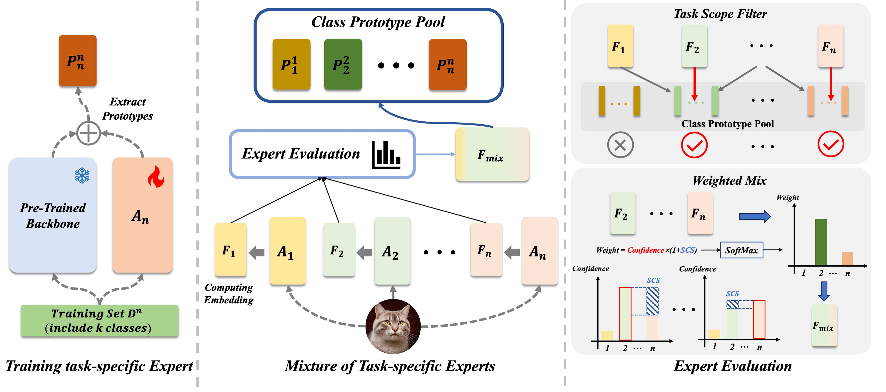
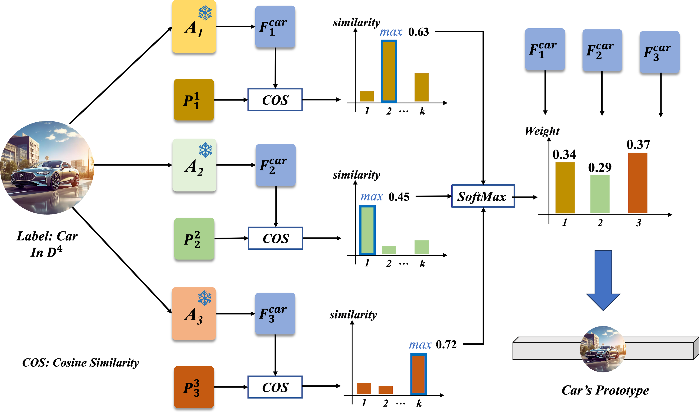

# MoTE: Mixture of Task-specific Experts for Pre-Trained ModelBased Class-incremental Learning

Class-incremental learning (CIL) requires deep learning models to continuously acquire new knowledge from streaming data while preserving previously learned information. Recently, CIL based on pre-trained models (PTMs) has achieved remarkable success. However, prompt-based approaches suffer from prompt overwriting, while adapter-based methods face challenges such as dimensional misalignment between tasks. While the idea of expert fusion in Mixture of Experts (MoE) can help address dimensional inconsistency, both expert and routing parameters are prone to being overwritten in dynamic environments, making MoE challenging to apply directly in CIL. To tackle these issues, we propose a mixture of task-specific experts (MoTE) framework that effectively mitigates the miscalibration caused by inconsistent output dimensions across tasks. Inspired by the weighted feature fusion and sparse activation mechanisms in MoE, we introduce task-aware expert filtering and reliable expert joint inference during the inference phase, mimicking the behavior of routing layers without inducing catastrophic forgetting. Extensive experiments demonstrate the superiority of our method without requiring an exemplar set. 

Furthermore, the number of tasks in MoTE scales linearly with the number of adapters. Building on this, we further explore the trade-off between adapter expansion and model performance and propose the Adapter-Limited MoTE.


### Dataset
We provide the processed datasets as follows:
- **CIFAR100**: will be automatically downloaded by the code.
- **CUB200**:  Google Drive: [link](https://drive.google.com/file/d/1XbUpnWpJPnItt5zQ6sHJnsjPncnNLvWb/view?usp=sharing) or Onedrive: [link](https://entuedu-my.sharepoint.com/:u:/g/personal/n2207876b_e_ntu_edu_sg/EVV4pT9VJ9pBrVs2x0lcwd0BlVQCtSrdbLVfhuajMry-lA?e=L6Wjsc)
- **ImageNet-R**: Google Drive: [link](https://drive.google.com/file/d/1SG4TbiL8_DooekztyCVK8mPmfhMo8fkR/view?usp=sharing) or Onedrive: [link](https://entuedu-my.sharepoint.com/:u:/g/personal/n2207876b_e_ntu_edu_sg/EU4jyLL29CtBsZkB6y-JSbgBzWF5YHhBAUz1Qw8qM2954A?e=hlWpNW)
- **ImageNet-A**: Google Drive: [link](https://drive.google.com/file/d/19l52ua_vvTtttgVRziCZJjal0TPE9f2p/view?usp=sharing) or Onedrive: [link](https://entuedu-my.sharepoint.com/:u:/g/personal/n2207876b_e_ntu_edu_sg/ERYi36eg9b1KkfEplgFTW3gBg1otwWwkQPSml0igWBC46A?e=NiTUkL)
- **VTAB**: Google Drive: [link](https://drive.google.com/file/d/1xUiwlnx4k0oDhYi26KL5KwrCAya-mvJ_/view?usp=sharing) or Onedrive: [link](https://entuedu-my.sharepoint.com/:u:/g/personal/n2207876b_e_ntu_edu_sg/EQyTP1nOIH5PrfhXtpPgKQ8BlEFW2Erda1t7Kdi3Al-ePw?e=Yt4RnV)

You need to modify the path of the datasets in `./utils/data.py`  according to your own path.


## Running scripts

Please follow the settings in the `exps` folder to prepare json files, and then run:

```
python main.py --config ./exps/[datasets]/[filename].json
```

**Here is an example of how to run the code** 

if you want to run the cifar dataset using ViT-B/16-IN1K, you can follow the script: 
```
python main.py --config ./exps/cifar/mote.json
```

if you want to run the cifar dataset using ViT-B/16-IN21K, you can follow the script: 
```
python main.py --config ./exps/cifar/mote_in21k.json
```


## Acknowledgment

We would like to express our gratitude to the following repositories for offering valuable components and functions that contributed to our work.

- [PILOT: A Pre-Trained Model-Based Continual Learning Toolbox](https://github.com/sun-hailong/LAMDA-PILOT)